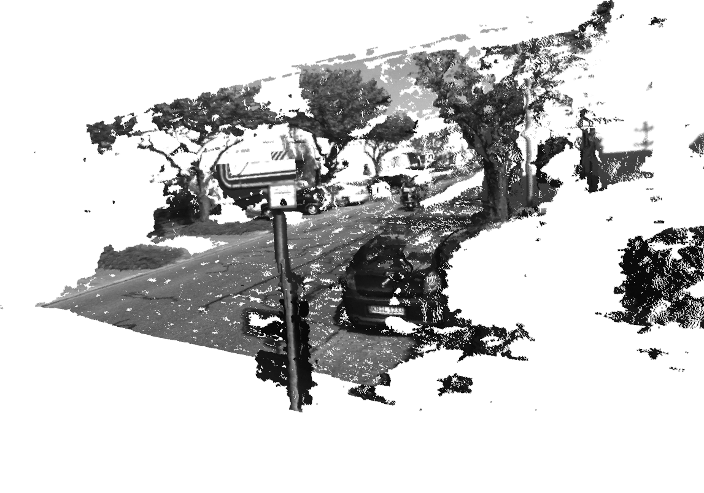
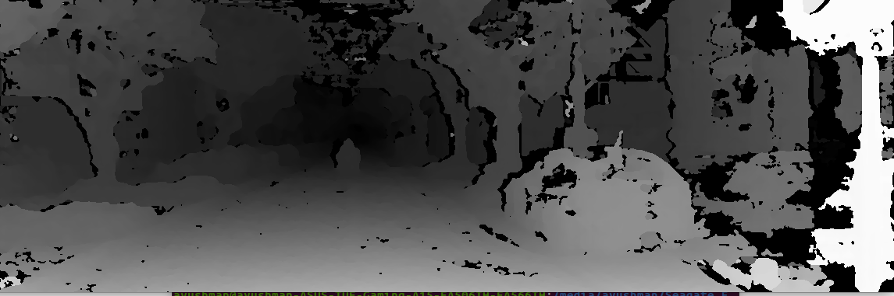
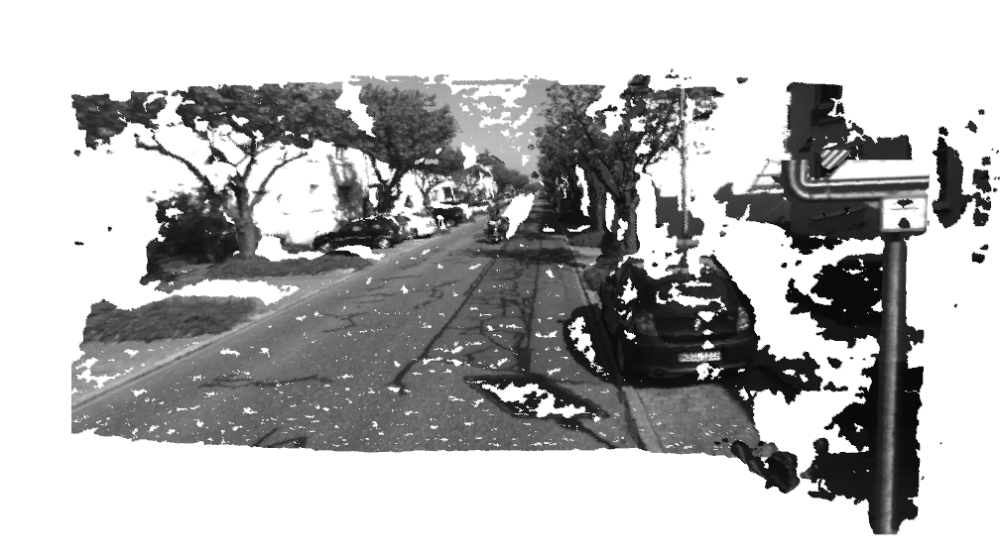
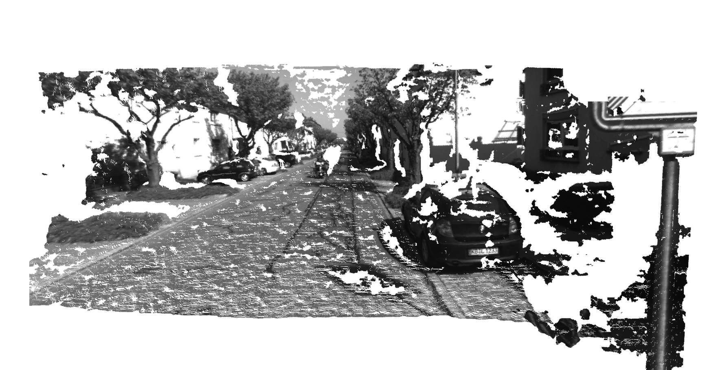

# Stereo-Image-to-PointCloud

## My First C++ Repo B) 

## Stereo Image -> Disparity -> Depth -> PointCloud 

# How to Setup 

1. Clone the Repo 
2. `cd Stereo-Image-to-PointCloud`
3. `mkdir build`
4. `cd build`
5. `cmake ..`
6. `make`
7. `./pointcloud`

## Disparity Output 

## PointCloud Output

## For any Query, feel free to ping me on Linkedin. 
## Thank you! 
## Star this repo if you find it interesting! ;) 
